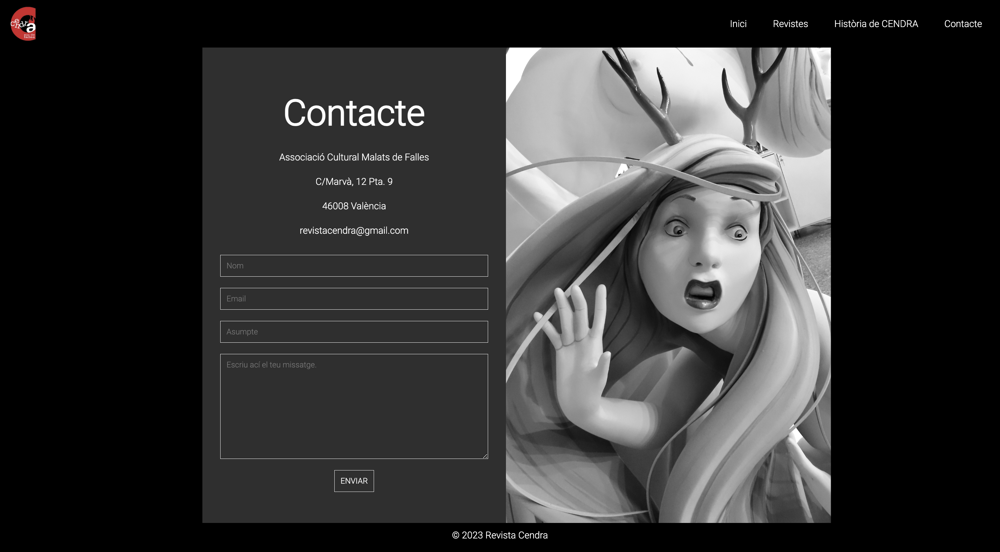
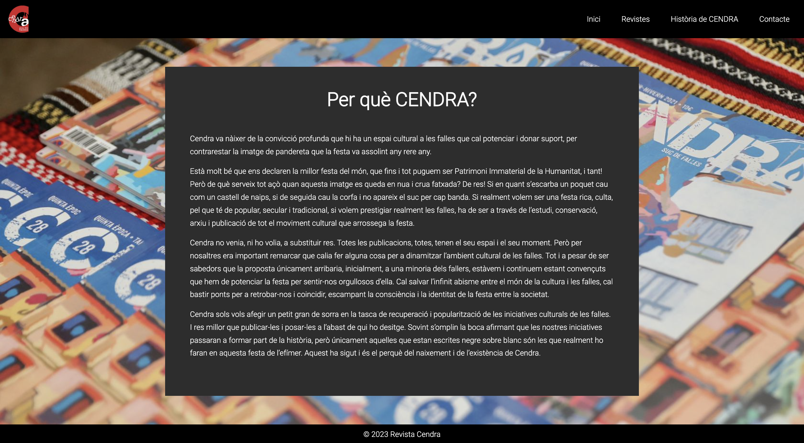

# RAMP-UP Project with HTML5 and CSS3 - By Andrea Mir Olba. 👩🏻‍💻

<h3 align="center">FIRST PROJECT MIXING HTML5 AND CSS3</h3>

<p align="center">I've built a webpage starting from basic HTML code, and then I added styles using CSS, as my initial exposure to both languages. </p>

## Goals of this project 🎯

The purpose of creating this project is to learn the fundamentals of web development, acquire essencial coding and web design skills and to prepare for more complex web projects in the future. 

### DIFFERENT TECHNOLOGIES USED IN THE PROJECT ⚡️

This project has been created using HTML, CSS with FLEXBOX. 
<objectives>
  <ol>
    <li>HTML5 TAGS</li>
    <li>ID'S AND CLASS</a></li>
    <li>PROPERTIES ADDED TO THE PREVIOUS CLASSES</a></li>
    <li>FLEXBOX</a></li>
  </ol>
</objectives>

### Built With 

[](https://shields.io/)

## Getting Started 💪🏻

In here you can appreciate an example of how you may give instructions on setting up your project locally.
To get a local copy up and running follow these simple example steps.

### Installation 🤓

1. Clone the repo
    ```sh
    git clone https://github.com/AndreaMir/PaginaWeb-RevistaCendra
    ```
2. Then is easy to use, easy to tell how it works.

## License

This project is under license of Andrea Mir.

## Project's review and GIFS

Here we can see with our gifs, how I did it, and how do they work.






## Contact 


<p align="center" >You can ask me anything here</p>
<p align="center" >Andrea Mir</p>
</br>
<p align="center">
<a href = "mailto:andreamirolba@gmail.com"></a>
    <a href="https://www.linkedin.com/in/andreamirolba/" target="_blank"></a> 